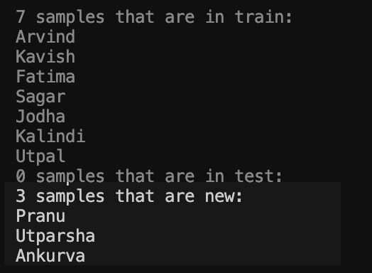

# Update:

Used indian names instead of prev dataset

# result:

 

# makemore

makemore takes one text file as input, where each line is assumed to be one training thing, and generates more things like it. Under the hood, it is an autoregressive character-level language model, with a wide choice of models from bigrams all the way to a Transformer (exactly as seen in GPT). For example, we can feed it a database of names, and makemore will generate cool baby name ideas that all sound name-like, but are not already existing names. Or if we feed it a database of company names then we can generate new ideas for a name of a company. Or we can just feed it valid scrabble words and generate english-like babble.

This is not meant to be too heavyweight library with a billion switches and knobs. It is one hackable file, and is mostly intended for educational purposes. [PyTorch](https://pytorch.org) is the only requirement.

Current implementation follows a few key papers:

- Bigram (one character predicts the next one with a lookup table of counts)
- MLP, following [Bengio et al. 2003](https://www.jmlr.org/papers/volume3/bengio03a/bengio03a.pdf)
- CNN, following [DeepMind WaveNet 2016](https://arxiv.org/abs/1609.03499) (in progress...)
- RNN, following [Mikolov et al. 2010](https://www.fit.vutbr.cz/research/groups/speech/publi/2010/mikolov_interspeech2010_IS100722.pdf)
- LSTM, following [Graves et al. 2014](https://arxiv.org/abs/1308.0850)
- GRU, following [Kyunghyun Cho et al. 2014](https://arxiv.org/abs/1409.1259)
- Transformer, following [Vaswani et al. 2017](https://arxiv.org/abs/1706.03762)

### Usage

The included `names.txt` dataset, as an example, has the most common 32K names takes from [ssa.gov](https://www.ssa.gov/oact/babynames/) for the year 2018. It looks like:

```
emma
olivia
ava
isabella
sophia
charlotte
...
```

Let's point the script at it:

```bash
$ python makemore.py -i names.txt -o names --device mps
```

Training progress and logs and model will all be saved to the working directory `names`. The default model is a super tiny 200K param transformer; Many more training configurations are available - see the argparse and read the code. Training does not require any special hardware, it runs on my Macbook Air and will run on anything else, but if you have a GPU then training will fly faster. As training progresses the script will print some samples throughout. However, if you'd like to sample manually, you can use the `--sample-only` flag, e.g. in a separate terminal do:

```bash
$ python makemore.py -i names.txt -o names --sample-only
```

This will load the best model so far and print more samples on demand. Here are some unique baby names that get eventually generated from current default settings (test logprob of ~1.92, though much lower logprobs are achievable with some hyperparameter tuning):

```
dontell
khylum
camatena
aeriline
najlah
sherrith
ryel
irmi
taislee
mortaz
akarli
maxfelynn
biolett
zendy
laisa
halliliana
goralynn
brodynn
romima
chiyomin
loghlyn
melichae
mahmed
irot
helicha
besdy
ebokun
lucianno
```

Have fun!

### License

MIT
